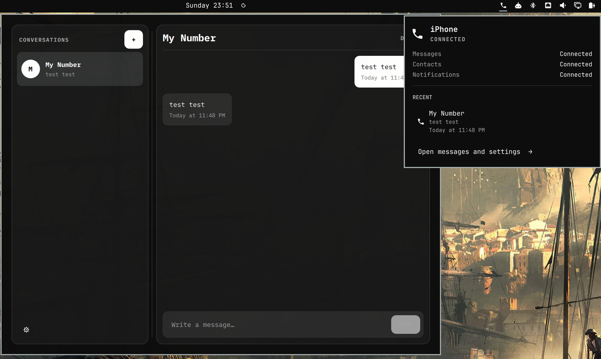

# BlueFerry for Omarchy Quattro

This is the native Omarchy panel for
[BlueFerry](https://github.com/erikwb/blueferry). It allows you to send and
receive iMessages over Bluetooth while paired to your iPhone with no special
software running on your phone, no proxies, and no cloud tricks. 

This widget shows connection health and unread conversations in the bar popup.
Click a conversation to write a quick reply, then press Enter or click Send.
Press Escape or the back arrow to return to the list; drafts stay available
until sent or the shell restarts. The ↗ button opens the conversation in the
full client, which also handles pairing and preferences.

Group replies use the members saved in BlueFerry. If a group's members need
review, open it in the full client before replying. Failed sends keep your
draft, and replies are never automatically retried.



Install it through Omarchy:

```bash
omarchy plugin add https://github.com/erikwb/omarchy-blueferry.git
```

Omarchy adds third-party plugins disabled. Review it, then enable BlueFerry
from **Setup › Plugins** and place it on the bar.

Remove it with:

```bash
omarchy plugin remove io.weirdware.blueferry
```

The widget expects `blueferry-backend` and `blueferry-quickshell` 0.8.0 or
newer. If they are missing, clicking it opens a terminal with the source-build
commands; it does not run them for you.

Run the reply tests with `python -m pytest -q tests` (requires pytest and
PySide6). On Omarchy, the UI test also uses Quickshell and bubblewrap to test
the native controls in isolation with a fake backend. It cannot send messages
or access the running desktop.

Licensed under [GPL version 2 only](LICENSE).
